# 📋 Tender Management System (TMS) — User Manual

> **Who is this guide for?** Anyone who needs to use the Tender Management System — whether you've never used it before or just need a refresher. No technical background required.

---

## Table of Contents

1. [What is TMS?](#1-what-is-tms)
2. [Logging In](#2-logging-in)
3. [Setting Your Password (First-Time Users)](#3-setting-your-password-first-time-users)
4. [Home Page Overview](#4-home-page-overview)
5. [Creating a Tender](#5-creating-a-tender)
   - [Option A: Upload a Document (AI-Assisted)](#option-a-upload-a-document-ai-assisted)
   - [Option B: Create Manually](#option-b-create-manually)
6. [Tender List — Viewing All Tenders](#6-tender-list--viewing-all-tenders)
7. [Tender Detail — Viewing Full Information](#7-tender-detail--viewing-full-information)
8. [Mind Map View](#8-mind-map-view)
9. [Forwarding a Tender to Workflow](#9-forwarding-a-tender-to-workflow)
10. [Logbook — Your Daily Work Hub](#10-logbook--your-daily-work-hub)
11. [Filling a Tender (Tender Fill)](#11-filling-a-tender-tender-fill)
12. [Tender Data Table — Analytics View](#12-tender-data-table--analytics-view)
13. [Understanding Tender Status & Workflow](#13-understanding-tender-status--workflow)

---

## 1. What is TMS?

The **Tender Management System (TMS)** is an enterprise tool that helps your organisation:

- 📥 **Collect and store** tender documents in one place
- 🤖 **Automatically extract** key information from tender PDFs using AI
- 🔄 **Route tenders through a workflow** — from review to final submission
- 📊 **Track and visualise** the status of every tender at a glance

Think of it like a smart filing cabinet that also knows how to read tender documents and distribute them to the right people.

---

## 2. Logging In

When you open the application, you'll land on the **Sign In** page.

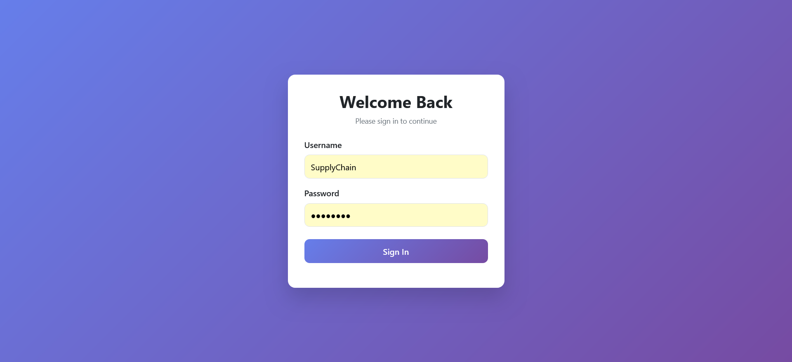

**Steps:**
1. Enter your **Username** in the first field.
2. Enter your **Password** in the second field.
3. Click the **Sign In** button.

>Your username will be your organization mail Id. 

> 💡 Your username and temporary password are provided by your system administrator. If you don't have them, contact your admin.

---

## 3. Setting Your Password (First-Time Users)

If this is your first time logging in, the system will ask you to **set a new, secure password** before proceeding.

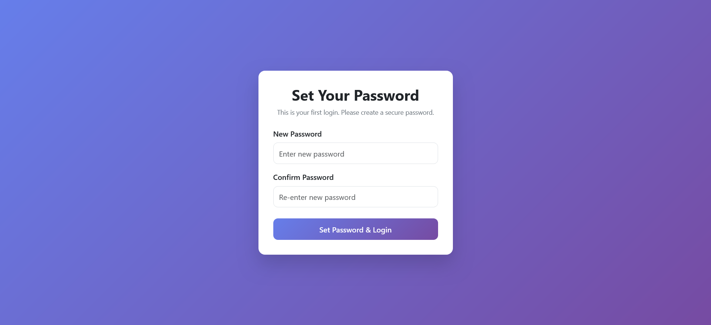

**Steps:**
1. Enter a new password in the **New Password** field.
2. Re-enter the same password in the **Confirm Password** field.
3. Click **Set Password & Login**.

You will then be taken directly to the Home page. From this point on, use your new password to log in.

> ⚠️ **Important:** Choose a strong password. Do not share it with anyone.

---

## 4. Home Page Overview

After logging in, you'll see the **Home Page** — your main navigation hub.

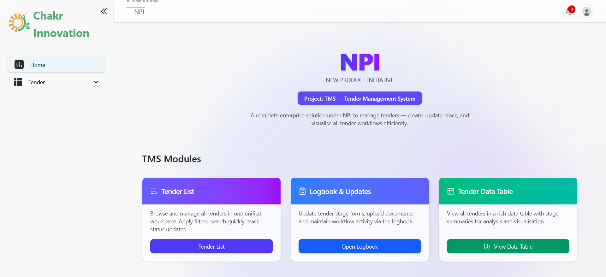

The home page shows three main modules you can access:

| Module | What it does |
|--------|-------------|
| **Tender List** | Browse and manage all tenders. Search, filter, and take action. |
| **Logbook & Updates** | Update stage forms, upload documents, and track workflow activity. |
| **Tender Data Table** | View all tenders in a detailed analytics table. |

You can also navigate using the **left sidebar** at any time:
- **Home** — returns to this page
- **Tender → Tender List** — full list of all tenders
- **Tender → Logbook** — your daily work queue
- **Tender → Data Table** — analytics view

---

## 5. Creating a Tender

To add a new tender to the system, go to **Tender List** and click the **+ Create Tender** button (top-right corner of the table).

There are two ways to create a tender:

---

### Option A: Upload a Document (AI-Assisted)

This is the **recommended and fastest** method. The system reads your tender PDF and fills in the details automatically.

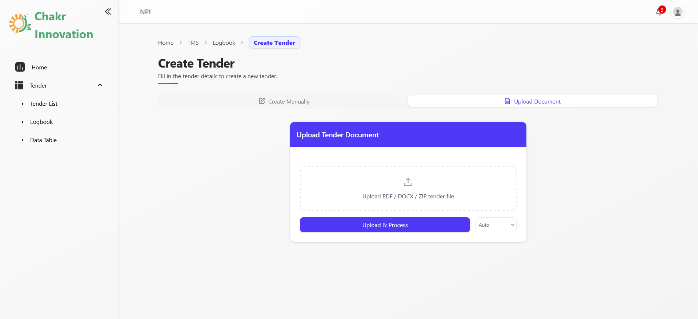

**Steps:**
1. Click the **Upload Document** tab.
2. Drag and drop your tender file into the upload area, or click the area to browse your computer.
   - Accepted formats: **PDF, DOCX, ZIP** (max file size as configured by admin)
3. Click **Upload & Process**.
4. The system will process the document in the background using AI. A progress indicator will keep you informed.
5. Once done, the tender will appear in your **Tender List** with all extracted details filled in.

> 💡 If you upload a **ZIP file**, all documents inside it will be saved and text documents will be processed for extraction.

---

### Option B: Create Manually

If you prefer to enter details yourself (or don't have a document), use the **Create Manually** tab.

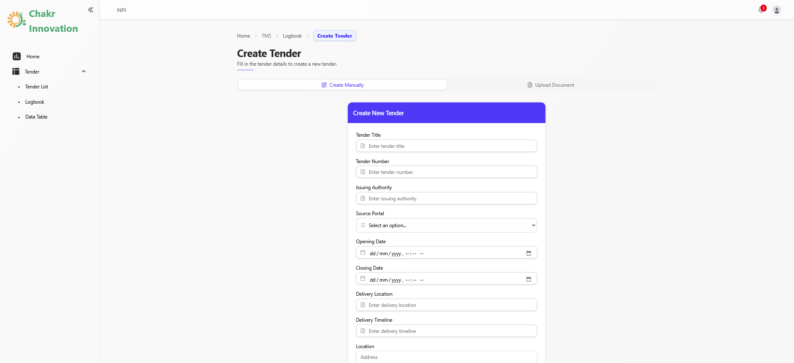

**Steps:**
1. Click the **Create Manually** tab.
2. Fill in the form fields:
   - **Tender Title** — the name of the tender
   - **Tender Number** — the official reference number
   - **Issuing Authority** — who issued the tender
   - **Source Portal** — where the tender was found (select from dropdown)
   - **Opening Date & Closing Date** — the key dates
   - **Delivery Location & Timeline**
   - **Location details** (Address, State, Pincode)
   - Financial details, eligibility, and other fields as shown
3. Scroll down and fill in all required fields.
4. Click **Save / Submit** at the bottom.

---

## 6. Tender List — Viewing All Tenders

The **Tender List** gives you a bird's-eye view of all tenders in the system.

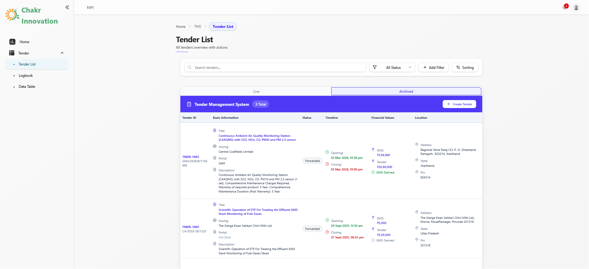

**Key features on this page:**

- **Search bar** — Type any keyword to find tenders instantly
- **All Status filter** — Filter tenders by their current status (e.g., Forwarded, In Progress)
- **Add Filter** — Apply advanced filters (by date, location, portal, etc.)
- **Sorting** — Sort the list by any column
- **Live / Archived tabs** — Switch between active tenders and archived ones
- **+ Create Tender** — Add a new tender (see Section 5)

**Each row in the list shows:**
- Tender ID and reference number
- Title, issuing body, portal, and description
- Current status badge
- Timeline (Opening, Closing, Deadline dates)
- Financial values (EMD amount, Tender value)
- Location (Address, State, Pin)
- Operations scope (Install, Maintain, Service, Supply)
- Documents uploaded
- **View** button — to see full tender details
- **Forward** button — to start the workflow (see Section 9)

---

## 7. Tender Detail — Viewing Full Information

Click the **View** button next to any tender to open its **Tender Detail** page.

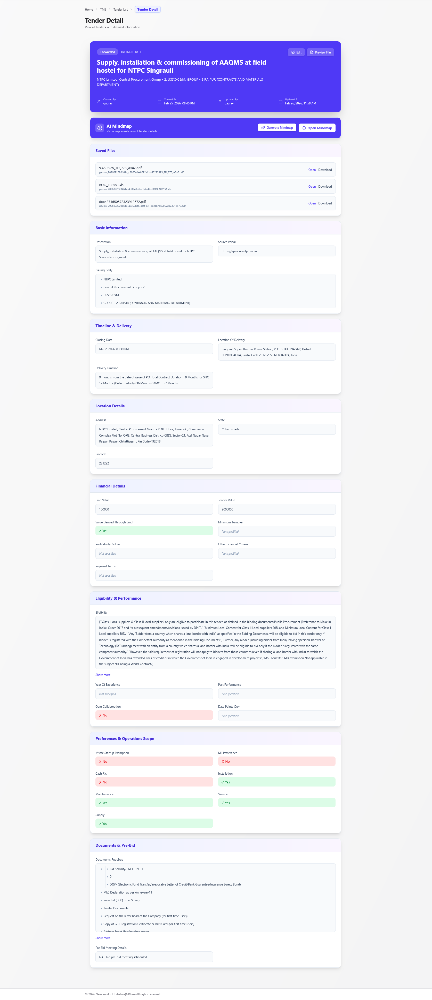

This page shows everything about the tender, organised into sections:

| Section | What you'll find |
|---------|-----------------|
| **Saved Files** | All uploaded documents — click **Open** or **Download** |
| **AI Mindmap** | Generate or open an interactive mind map of the tender |
| **Basic Information** | Description, source portal, issuing body |
| **Timeline & Delivery** | Closing date, delivery location, timeline |
| **Location Details** | Full address, state, pincode |
| **Financial Details** | EMD value, tender value, turnover, payment terms |
| **Eligibility & Performance** | Eligibility criteria, OEM collaboration, experience |
| **Preferences & Operations Scope** | Install/Maintain/Service/Supply flags, startup exemption |
| **Documents & Pre-Bid** | Required documents checklist, pre-bid meeting details |

> 💡 Use the **Edit** button (pencil icon) at the top to update any details if needed.

---

## 8. Mind Map View

Each tender can be visualised as an interactive **Mind Map** — a visual breakdown of all its key information.

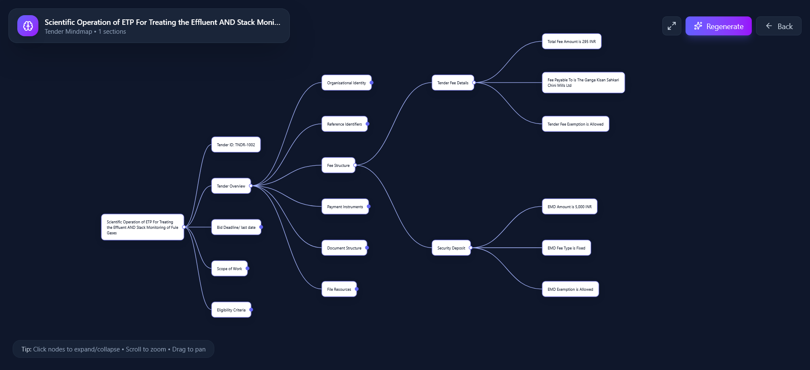

**How to open the Mind Map:**
1. Open a tender's **Detail** page (click View from Tender List).
2. Scroll to the **AI Mindmap** section.
3. Click **Generate Mindmap** (first time) or **Open Mindmap** (if already generated).

**In the Mind Map:**
- The tender title is the central node
- Click any node to **expand or collapse** its children
- **Scroll** to zoom in/out
- **Drag** to pan around
- Click **Regenerate** to refresh with the latest data
- Click **Back** to return to the tender detail

The mind map covers sections like: Tender Overview, Bid Deadline, Scope of Work, Fee Structure, Security Deposit, Eligibility Criteria, and more.

---

## 9. Forwarding a Tender to Workflow

Once a tender is reviewed and ready, you need to **Forward** it to start the internal workflow process.

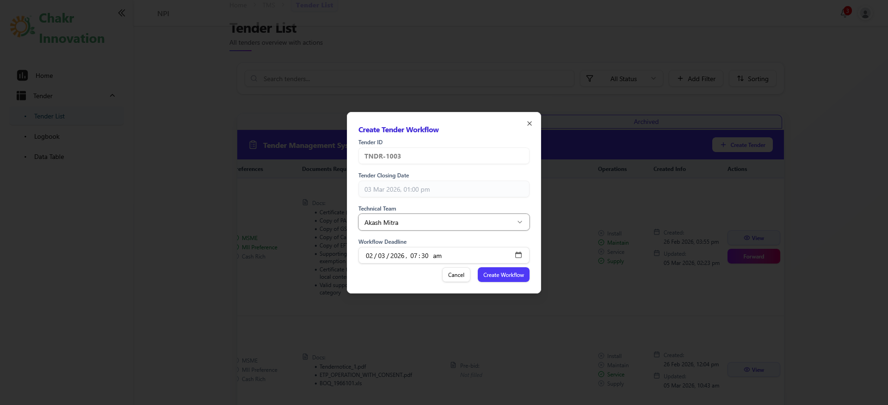

**Steps:**
1. On the **Tender List**, find the tender you want to forward.
2. Click the **Forward** button (purple, on the right side of the row).
3. A popup will appear — **Create Tender Workflow**:
   - **Tender ID** — auto-filled
   - **Tender Closing Date** — auto-filled from tender details
   - **Technical Team** — select the team member responsible
   - **Workflow Deadline** — set the date and time by which the workflow must be completed
4. Click **Create Workflow**.

The tender status will change to **Forwarded** and it will now appear in the **Logbook** for the assigned team to action.

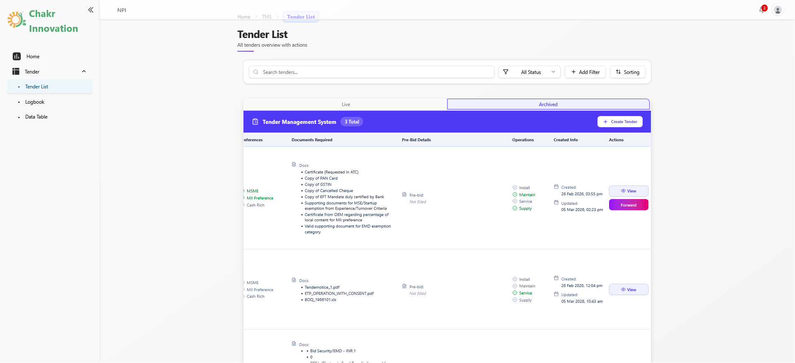

> ⚠️ Only forward a tender when you are confident the information is correct. The workflow starts immediately after forwarding.

---

## 10. Logbook — Your Daily Work Hub

The **Logbook** is where you see all tenders that need your attention — your personal work queue.

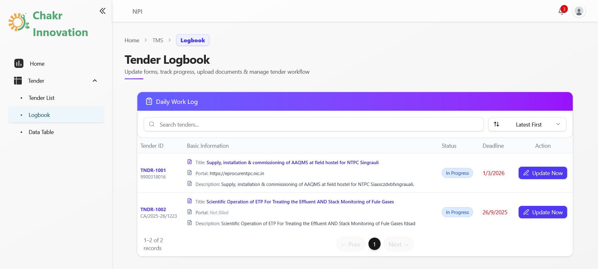

**What you see here:**
- List of tenders assigned to you or your group
- Current **Status** of each tender
- **Deadline** date (highlighted in red if overdue)
- **Update Now** button to open the tender and fill in your stage

**Steps to work on a tender:**
1. Go to **Tender → Logbook** from the sidebar.
2. Find the tender you need to work on.
3. Click **Update Now** — this opens the **Tender Fill** page (see Section 11).

---

## 11. Filling a Tender (Tender Fill)

The **Tender Fill** page is where the actual workflow work happens. Each tender goes through multiple stages, and each stage requires different information.

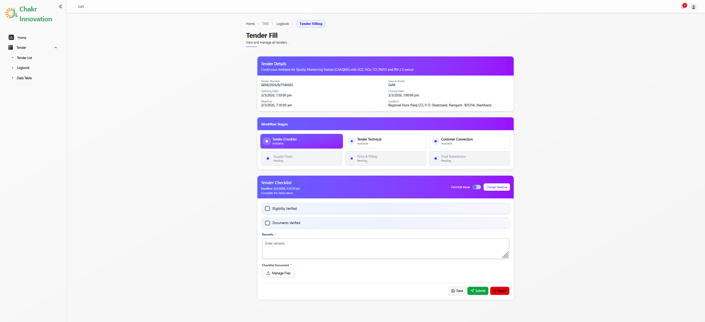

### Understanding the Layout

**Top Section — Tender Details:**
Shows the tender name, number, portal, opening/closing dates, deadline, and location — for reference while you work.

**Middle Section — Workflow Stages:**
Shows all the stages this tender must go through. Each stage has a status:
- 🔵 **Available** — you can work on this stage now
- ⚪ **Pending** — waiting for a previous stage to complete
- ✅ **Submitted** — stage completed

Example stages (yours may differ):
1. **Tender Checklist** — verify eligibility and documents
2. **Tender Technical** — prepare BOQ, technical summary
3. **Customer Connection** — customer liaison details
4. **Supply Chain** — supply chain information
5. **Price & Filling** — pricing details
6. **Final Submission** — final sign-off

### How to Fill a Stage

1. Click on the stage you want to work on (e.g., **Tender Checklist**).
2. The form for that stage appears below.
3. Fill in all the required fields:
   - Checkboxes (tick to confirm)
   - Text fields (type your response)
   - File uploads (click **Manage Files** to attach documents)
4. Use the **Field Edit Mode** toggle (top right of the form) to add or edit fields if permitted.(**Supervisor**)
5. Use **Change Deadline** if you need to adjust the stage deadline.(**Supervisor**)

### Submitting, Saving, or Rejecting

At the bottom of the form, you have three buttons:

| Button | What it does |
|--------|-------------|
| 💾 **Save** | Saves your progress without submitting — you can come back later |
| ✅ **Submit** | Marks the stage as complete and moves it to the next stage |
| ❌ **Reject** | Rejects and sends the tender back (with a reason) |

> 💡 Always **Save** before leaving the page if you're not ready to submit.

---

## 12. Tender Data Table — Analytics View

The **Tender Data Table** gives you a rich overview of all tenders with their stage-by-stage status in one place.

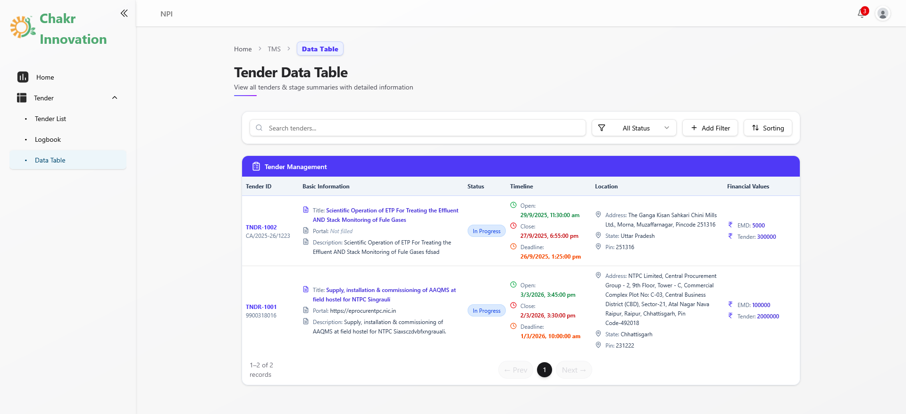

**What you can do here:**
- See every tender along with its financial values, timeline, location, and status
- View the status of each workflow stage (how many fields filled, stage status)
- Click the **eye icon** 👁 on any stage cell to see the filled data for that stage
- Search, filter, and sort — same as Tender List

### Viewing Stage Details

Click the eye icon on any stage cell to open a **Stage Detail popup**:

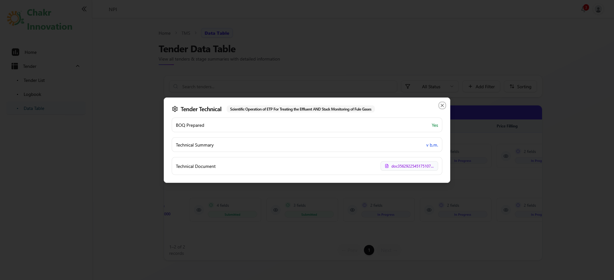

This shows all fields filled in for that stage — for example, the **Tender Technical** stage shows:
- BOQ Prepared: Yes/No
- Technical Summary
- Technical Document (with download link)

> 💡 The Data Table is great for managers who need a quick summary of where each tender stands without opening individual records.

---


## 13. Understanding Tender Status & Workflow

Here's a quick guide to what each status means:

| Status | Meaning |
|--------|---------|
| **Forwarded** | Tender has been sent to workflow — assigned team is working on it |
| **In Progress** | Workflow stages are actively being filled |
| **Submitted** | A stage has been completed and submitted |
| **Pending** | Stage is waiting for a previous stage to complete |
| **Rejected** | A stage was rejected and needs to be revisited |
| **Archived** | Tender has been closed/archived |

### The Full Flow at a Glance

```
Upload / Create Tender
        ↓
   Tender Detail
  (review & verify)
        ↓
   Forward to Workflow
  (assign team & deadline)
        ↓
   Logbook → Update Now
        ↓
  Fill Workflow Stages
  (Checklist → Technical → Supply → Price → Submit)
        ↓
   Final Submission
```

---

*This manual covers the core functionality of TMS. For technical issues or access problems, please contact your system administrator.*

*© Chakr Innovation — Tender Management System*